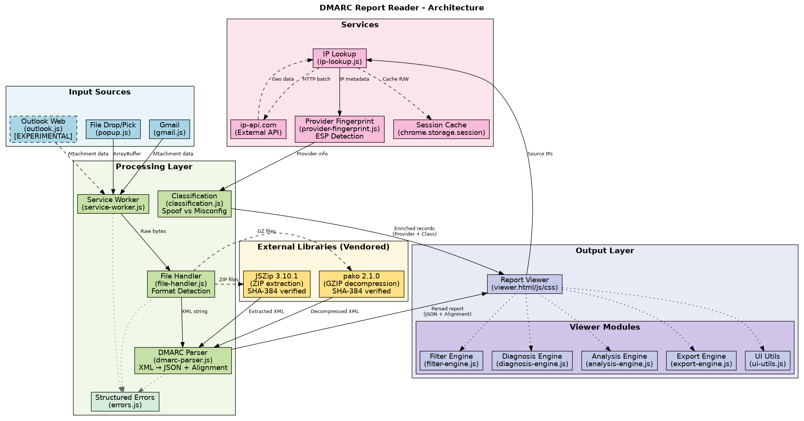

# DMARC Report Reader - Architecture

## Overview

DMARC Report Reader is a Manifest V3 Chrome/Edge browser extension that processes DMARC aggregate reports in XML format (plain, GZIP-compressed, or ZIP-archived) and presents them in a human-readable format with error diagnosis and recommendations.

## Architecture Diagram



## Components

### Input Layer

| Component | File | Description |
|-----------|------|-------------|
| Popup | `src/popup/popup.js` | Handles drag-drop and file picker input |
| Gmail Content Script | `src/content/gmail.js` | Detects DMARC attachments in Gmail, injects viewer button |
| Outlook Content Script | `src/content/outlook.js` | Detects DMARC attachments in Outlook Web, injects viewer button |
| Viewer Drop Zone | `src/viewer/viewer.js` | Accepts drag-drop directly in viewer |

### Processing Layer

| Component | File | Description |
|-----------|------|-------------|
| Service Worker | `src/background/service-worker.js` | Central message hub, orchestrates processing |
| File Handler | `src/parser/file-handler.js` | Detects file format, extracts XML content |
| DMARC Parser | `src/parser/dmarc-parser.js` | Parses DMARC XML into structured JSON with statistics |

### External Libraries

| Library | Purpose | Location |
|---------|---------|----------|
| JSZip | ZIP file extraction | `lib/jszip.min.js` |
| pako | GZIP decompression | `lib/pako.min.js` |

### Services

| Service | File | Description |
|---------|------|-------------|
| IP Lookup | `src/services/ip-lookup.js` | Fetches geolocation and reverse DNS for source IPs |

**External API**: ip-api.com (free tier, 45 requests/minute, batch endpoint for efficiency)

### Output Layer

| Component | Files | Description |
|-----------|-------|-------------|
| Report Viewer | `src/viewer/viewer.html`, `viewer.js`, `viewer.css` | Full-page report display with filtering, sorting, export |

## Data Flow

### File Processing Pipeline

```
Input File (XML/ZIP/GZ)
         │
         ▼
   ┌─────────────┐
   │ File Handler│ ─── Detect format via magic bytes
   └─────────────┘
         │
    ┌────┴────┬────────┐
    ▼         ▼        ▼
  [XML]    [GZIP]    [ZIP]
    │         │        │
    │    ┌────┘   ┌────┘
    │    ▼        ▼
    │  pako    JSZip
    │    │        │
    │    └───┬────┘
    │        │
    ▼        ▼
   ┌──────────────┐
   │ DMARC Parser │ ─── XML → Structured JSON + Statistics
   └──────────────┘
         │
         ▼
   ┌─────────────┐
   │ IP Lookup   │ ─── Enrich with geolocation & hostname
   └─────────────┘
         │
         ▼
   ┌─────────────┐
   │ Viewer      │ ─── Render, filter, diagnose, export
   └─────────────┘
```

### Message Passing

The extension uses Chrome's messaging API for communication:

```
Content Script ──processAttachment──▶ Service Worker
       │                                    │
       │                                    ▼
       │                             File Extraction
       │                                    │
       │                                    ▼
       │                             chrome.storage.local
       │                                    │
       └──────────────────────────────────▶ Viewer Tab
```

### Webmail Integration Flow

The extension uses the Chrome Downloads API for seamless webmail integration, as direct attachment access is blocked by webmail security policies.

```
Gmail/Outlook Page Load
         │
         ▼
   MutationObserver watches DOM
         │
         ▼
   TreeWalker scans for DMARC filenames
         │
         ▼
   Inject "View DMARC Report" button
         │
         ▼
   On click: Notify service worker → Trigger native download
         │
         ▼
   Service Worker monitors chrome.downloads.onChanged
         │
         ▼
   Download completes → Auto-open viewer with ?fromDownload=true
         │
         ▼
   Viewer shows notification, auto-opens file picker
         │
         ▼
   User selects downloaded file → Report displayed
         │
         ▼
   Cleanup: Downloaded file removed after processing
```

**Key Design Decisions:**

1. **Download-based approach**: Gmail/Outlook block direct attachment fetch from content scripts. The extension triggers the native download button and monitors for completion.

2. **Automatic viewer launch**: When a DMARC file download completes, the viewer opens automatically with the filename shown.

3. **File cleanup**: Downloaded files are removed from disk and download history after successful processing (or after 5-minute timeout as fallback).

4. **Duplicate prevention**: WeakSet tracks processed DOM elements to prevent multiple button injections.

## Viewer Features

### Summary Statistics

The parser calculates:
- Total message count
- DKIM/SPF pass/fail counts
- Quarantine/reject counts
- Pass rate percentages

### Filtering & Sorting

| Filter | Description |
|--------|-------------|
| All | Show all records |
| Pass | Both DKIM and SPF passed |
| Fail | Either DKIM or SPF failed |
| Quarantine | Disposition = quarantine |
| Reject | Disposition = reject |

| Sort | Description |
|------|-------------|
| Count (High-Low) | Most messages first |
| Count (Low-High) | Fewest messages first |
| IP Address | Alphabetical by IP |

### Error Diagnosis

The viewer provides contextual diagnosis for:

| Issue Type | Examples |
|------------|----------|
| DKIM Failures | Invalid signature, no signature, DNS errors |
| SPF Failures | Unauthorized IP, soft fail, no record, lookup limit |
| Alignment | Header/envelope From mismatch, domain not aligned |
| Disposition | Explains impact of quarantine/reject |

### Export Formats

| Format | Contents |
|--------|----------|
| JSON | Full structured report with all fields |
| CSV | Flat table with key fields for spreadsheet analysis |

## DMARC Report Structure

### Input XML Schema

```xml
<feedback>
  <report_metadata>
    <org_name>google.com</org_name>
    <email>noreply-dmarc-support@google.com</email>
    <report_id>...</report_id>
    <date_range>
      <begin>1234567890</begin>
      <end>1234567890</end>
    </date_range>
  </report_metadata>
  <policy_published>
    <domain>example.com</domain>
    <adkim>r</adkim>
    <aspf>r</aspf>
    <p>quarantine</p>
    <sp>quarantine</sp>
    <pct>100</pct>
  </policy_published>
  <record>
    <row>
      <source_ip>192.0.2.1</source_ip>
      <count>10</count>
      <policy_evaluated>
        <disposition>none</disposition>
        <dkim>pass</dkim>
        <spf>pass</spf>
        <reason>...</reason>
      </policy_evaluated>
    </row>
    <identifiers>
      <header_from>example.com</header_from>
      <envelope_from>bounce.example.com</envelope_from>
    </identifiers>
    <auth_results>
      <dkim>
        <domain>example.com</domain>
        <selector>selector1</selector>
        <result>pass</result>
      </dkim>
      <spf>
        <domain>example.com</domain>
        <result>pass</result>
      </spf>
    </auth_results>
  </record>
</feedback>
```

### Parsed JSON Structure

```javascript
{
  metadata: {
    orgName: "google.com",
    email: "...",
    reportId: "...",
    dateRange: { begin: Date, end: Date }
  },
  policy: {
    domain: "example.com",
    adkim: "relaxed",
    aspf: "relaxed",
    policy: "quarantine",
    subdomainPolicy: "quarantine",
    percentage: 100
  },
  records: [
    {
      sourceIp: "192.0.2.1",
      count: 10,
      policyEvaluated: {
        disposition: "none",
        dkim: "pass",
        spf: "pass",
        reasons: []
      },
      identifiers: {
        headerFrom: "example.com",
        envelopeFrom: "bounce.example.com",
        envelopeTo: "gmail.com"
      },
      authResults: {
        dkim: [{ domain, selector, result }],
        spf: [{ domain, scope, result }]
      },
      alignment: {
        headerEnvelopeMismatch: false
      }
    }
  ],
  summary: {
    totalMessages: 10,
    passedDkim: 10,
    failedDkim: 0,
    passedSpf: 10,
    failedSpf: 0,
    passedBoth: 10,
    failedBoth: 0,
    quarantined: 0,
    rejected: 0,
    dkimPassRate: 100,
    spfPassRate: 100,
    overallPassRate: 100
  }
}
```

## Security Considerations

1. **Content Security Policy**: Manifest V3 enforces strict CSP
2. **Local Processing**: All file parsing happens client-side
3. **Minimal Permissions**: Only requests necessary host permissions
4. **External API**: Only IP addresses are sent to ip-api.com (no email content)
5. **No Data Storage**: Reports are processed in memory only, not persisted
6. **Sandboxed Context**: Content scripts run in isolated worlds

## Browser Compatibility

- Chrome 88+ (Manifest V3 support)
- Edge 88+ (Chromium-based)
- Firefox: Not supported (different extension API)
